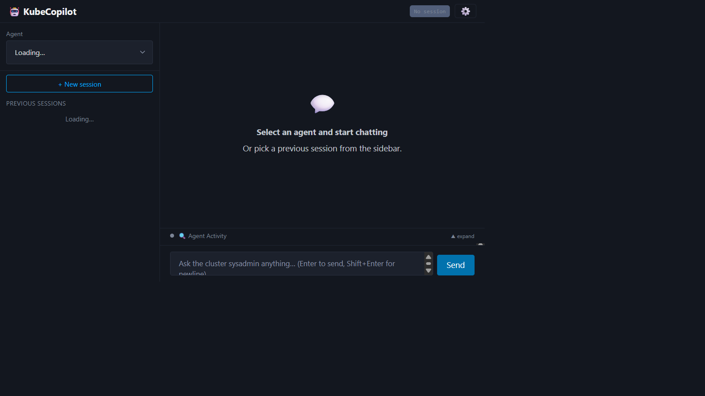
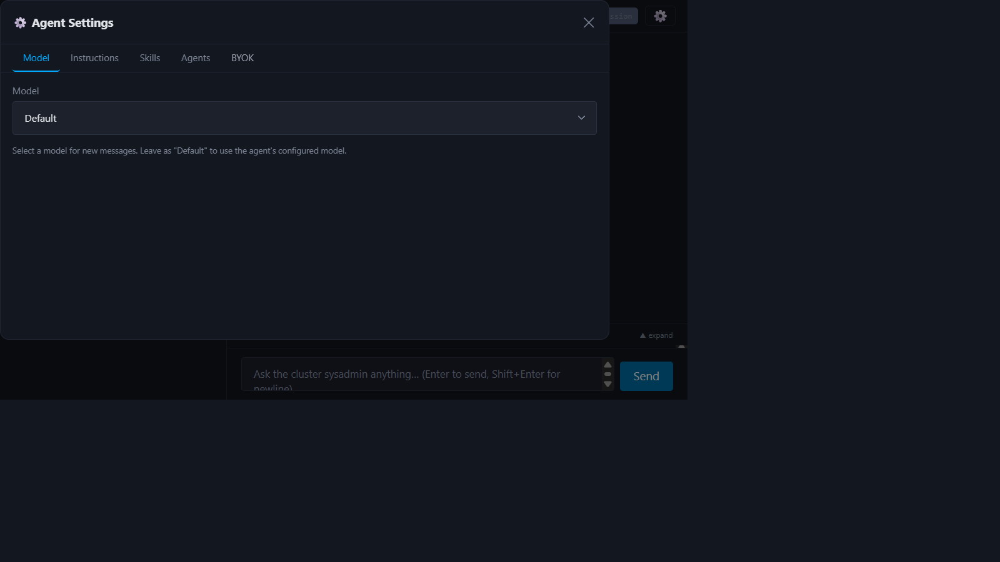
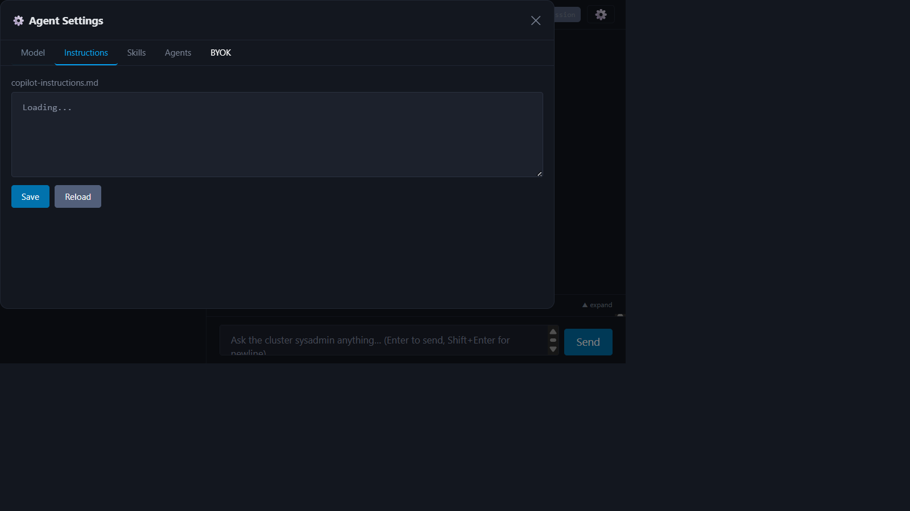
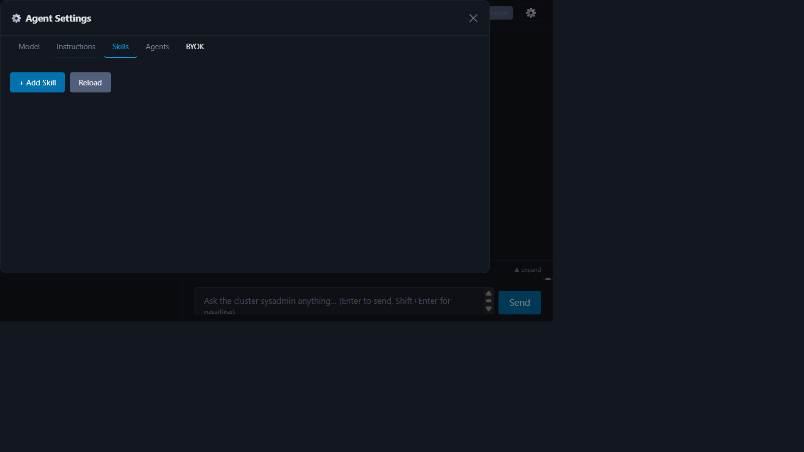
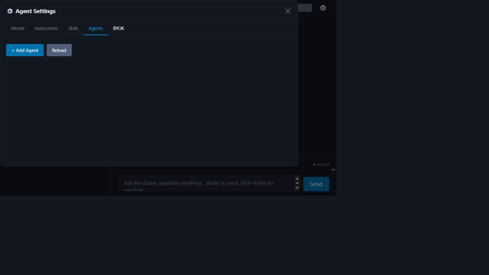
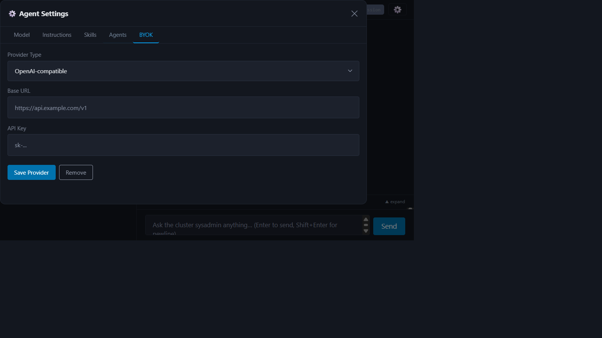

<div align="center">

# KubeCopilot

**The pluggable, engine-agnostic AI agent platform for Kubernetes and OpenShift**

[](https://opensource.org/licenses/Apache-2.0)
[](https://kubernetes.io)
[](https://www.redhat.com/en/technologies/cloud-computing/openshift)
[](https://go.dev)
[](https://python.org)

</div>

KubeCopilot is a Kubernetes operator that deploys and manages AI agents inside your cluster, controlled entirely through CRDs. Unlike read-only AI assistants, KubeCopilot agents **can reason, plan, and execute** — running kubectl commands, managing resources, and automating complex operations autonomously.

### Why KubeCopilot?

Most Kubernetes AI assistants are limited to answering questions — they can't actually *do* anything on your cluster. KubeCopilot is different. Agents execute real operations: running kubectl commands, creating resources, diagnosing issues, and automating multi-step workflows — all governed by Kubernetes RBAC and fully auditable through CRDs.

The operator is **engine-agnostic**: swap the AI backend by changing a container image in your CR — no code changes, no redeployment. Skills, instructions, custom agents, and even the LLM model can be reconfigured at runtime through the Web UI, without restarting a single pod. Real-time streaming via `KubeCopilotChunk` CRDs gives full visibility into agent reasoning, tool calls, and results as they happen.

KubeCopilot runs on **both vanilla Kubernetes and OpenShift**, with a native OpenShift Console Plugin that embeds the chat UI directly into the web console.

> [!WARNING]
> **Disclaimer:** This project is experimental and has not been tested in a production or live environment. It may contain bugs, security vulnerabilities, or incomplete features. Running AI agents with cluster access carries inherent risks — agents may execute unintended commands or access sensitive resources. **Use at your own risk.** Review all manifests, RBAC rules, and agent instructions carefully before deploying in any environment you care about.

---

## Table of Contents

- [Features](#features)
- [Screenshots](#screenshots)
- [Architecture](#architecture) · [full docs →](docs/architecture.md)
- [Quick Start](#quick-start)
- [Installation](#installation) · [full docs →](docs/installation.md)
- [Usage](#usage) · [full docs →](docs/usage.md)
- [Multi-Tenant Sessions](docs/multi-tenant.md)
- [Configuration](#configuration) · [full docs →](docs/configuration.md)
- [Agent Server Container](#agent-server-container) · [full docs →](docs/agent-server.md)
- [Development](#development) · [full docs →](docs/development.md)
- [Contributing](#contributing)
- [Uninstall](#uninstall)
- [License](#license)

---

## Features

- **Pluggable agent engines** — swap the AI backend by changing the container image in your `KubeCopilotAgent` CR
- **Multi-tenant session isolation** — `KubeCopilotSession` CRD creates a dedicated namespace per tenant with deny-all NetworkPolicy and scoped RBAC; see [Multi-Tenant Guide](docs/multi-tenant.md)
- **Multi-turn conversations** with session continuity
- **Real-time streaming** of agent activity via `KubeCopilotChunk` CRDs
- **Custom skills** loaded from a ConfigMap or managed at runtime via the UI
- **Custom instructions** via an `AGENT.md` ConfigMap or editable live
- **Custom agents** — define inline agent personas with specific prompts and tool sets
- **Dynamic model selection** — switch models at runtime without redeploying
- **BYOK (Bring Your Own Key)** — use an external OpenAI-compatible or Azure OpenAI provider, with API keys stored securely in Kubernetes Secrets
- **Cancellation** of in-flight requests
- **Web UI** with a settings panel for chatting with agents, browsing session history, and configuring agent behaviour at runtime
- **OpenShift Console Plugin** — embed the UI directly inside the OpenShift Web Console

See [Agent Server Container](#agent-server-container) for the full pluggable architecture and how to add new engines.

---

## Screenshots

<details>
<summary><strong>Main Chat Interface</strong></summary>



</details>

<details>
<summary><strong>Settings — Model Selection</strong></summary>



</details>

<details>
<summary><strong>Settings — Instructions Editor</strong></summary>



</details>

<details>
<summary><strong>Settings — Skills Management</strong></summary>



</details>

<details>
<summary><strong>Settings — Custom Agents</strong></summary>



</details>

<details>
<summary><strong>Settings — BYOK Provider Configuration</strong></summary>



</details>

---

## Architecture

The operator reconciles CRDs (`KubeCopilotSend`, `KubeCopilotChunk`, `KubeCopilotResponse`, `KubeCopilotCancel`, `KubeCopilotSession`) and delegates work to a pluggable agent server pod. The Web UI creates CRs and streams results back to the user via SSE. `KubeCopilotSession` provides namespace-per-tenant isolation for multi-tenant deployments.

For detailed architecture diagrams and CRD descriptions, see **[Architecture](docs/architecture.md)**.

---

## Quick Start

Get up and running in four steps. See [Installation](#installation) for full configuration options.

**1. Install the operator**

```sh
helm upgrade --install kube-copilot-agent ./helm/kube-copilot-agent \
  --namespace kube-copilot-agent --create-namespace
```

**2. Deploy an agent**

```sh
helm upgrade --install my-agent ./helm/github-copilot-agent \
  --namespace kube-copilot-agent \
  --set githubToken.value=<your-github-pat>
```

**3. Deploy the Web UI**

```sh
helm upgrade --install kube-copilot-ui ./helm/kube-copilot-ui \
  --namespace kube-copilot-agent
```

**4. Access the UI**

```sh
kubectl port-forward svc/kube-copilot-ui 8080:80 -n kube-copilot-agent
# Open: http://localhost:8080
```

> [!TIP]
> On OpenShift, use `--set route.enabled=true` in step 3 to create a Route instead of port-forwarding.

---

## Installation

There are three Helm charts, meant to be installed in order:

| Chart | Purpose |
|---|---|
| `helm/kube-copilot-agent` | The operator (CRDs + controller) |
| `helm/github-copilot-agent` | A GitHub Copilot agent instance |
| `helm/kube-copilot-ui` | The web UI |

### Prerequisites

- kubectl v1.20+
- Helm v3.10+
- Access to a Kubernetes or OpenShift cluster
- A GitHub account with Copilot access
- A GitHub Personal Access Token (PAT) with `copilot` scope

### Step 1 — Install the Operator

```sh
helm upgrade --install kube-copilot-agent ./helm/kube-copilot-agent \
  --namespace kube-copilot-agent \
  --create-namespace
```

If the namespace already exists:

```sh
helm upgrade --install kube-copilot-agent ./helm/kube-copilot-agent \
  --namespace kube-copilot-agent \
  --set createNamespace=false
```

**Key operator values:**

| Value | Default | Description |
|---|---|---|
| `namespace` | `kube-copilot-agent` | Namespace to deploy into |
| `createNamespace` | `true` | Create the namespace as part of the chart |
| `image.repository` | `quay.io/gfontana/kube-copilot-agent` | Operator image |
| `image.tag` | `v1.0` | Operator image tag |
| `image.pullPolicy` | `Always` | Image pull policy |
| `agentImage.repository` | `quay.io/gfontana/kube-github-copilot-agent-server` | Default agent image |
| `agentImage.tag` | `v1.0` | Default agent image tag |
| `replicaCount` | `1` | Operator replicas |
| `installCRDs` | `true` | Install CRDs with the chart |
| `rbac.create` | `true` | Create RBAC resources |
| `leaderElect` | `true` | Enable leader election |

### Step 2 — Create Credentials

Create a secret with your GitHub PAT:

```sh
kubectl create secret generic github-token \
  --from-literal=GITHUB_TOKEN=<your-pat> \
  -n kube-copilot-agent
```

Optionally, provide a kubeconfig so the agent can inspect your cluster:

```sh
kubectl create secret generic cluster-kubeconfig \
  --from-file=config=<path-to-kubeconfig> \
  -n kube-copilot-agent
```

Alternatively, use [ServiceAccount-based permissions](#serviceaccount-based-permissions) to let the operator manage RBAC for you automatically.

### Step 3 — Deploy the GitHub Copilot Agent

The `github-copilot-agent` chart creates the `KubeCopilotAgent` CR, a GitHub token Secret, and ConfigMaps for skills and `AGENT.md`. Default skills (monitor, deploy, troubleshoot) and a SysAdmin persona are included out of the box.

**Minimal install** (uses built-in skills and AGENT.md):

```sh
helm upgrade --install my-agent ./helm/github-copilot-agent \
  --namespace kube-copilot-agent \
  --set githubToken.value=<your-pat>
```

**With an existing token secret:**

```sh
helm upgrade --install my-agent ./helm/github-copilot-agent \
  --namespace kube-copilot-agent \
  --set githubToken.existingSecret=github-token
```

**With a kubeconfig secret** (so the agent can talk to the cluster):

```sh
helm upgrade --install my-agent ./helm/github-copilot-agent \
  --namespace kube-copilot-agent \
  --set githubToken.existingSecret=github-token \
  --set kubeconfigSecretRef=cluster-kubeconfig
```

**Custom skills and AGENT.md** via a values file:

```yaml
# my-agent-values.yaml
name: my-agent
githubToken:
  existingSecret: github-token

kubeconfigSecretRef: cluster-kubeconfig

createSkillsConfigMap: true
skillsContent:
  my-skill.md: |
    ---
    name: my-skill
    description: Does something useful
    ---
    # My Skill
    ...

createAgentConfigMap: true
agentContent:
  AGENT.md: |
    # My Agent
    You are a helpful Kubernetes assistant.
```

```sh
helm upgrade --install my-agent ./helm/github-copilot-agent \
  --namespace kube-copilot-agent \
  -f my-agent-values.yaml
```

**Key agent values:**

| Value | Default | Description |
|---|---|---|
| `name` | `github-copilot-agent` | Name of the `KubeCopilotAgent` CR |
| `namespace` | `kube-copilot-agent` | Target namespace |
| `githubToken.value` | `""` | PAT value (creates a new Secret) |
| `githubToken.existingSecret` | `""` | Reference an existing Secret |
| `githubToken.secretKey` | `GITHUB_TOKEN` | Key inside the secret |
| `image` | `""` | Override the agent container image |
| `storageSize` | `1Gi` | PVC size for session history |
| `kubeconfigSecretRef` | `""` | Existing Secret name with a kubeconfig |
| `rbac` | `{}` | RBAC config (SA, rules, clusterRules) — see [ServiceAccount Permissions](#serviceaccount-based-permissions) |
| `createSkillsConfigMap` | `true` | Create a skills ConfigMap from `skillsContent` |
| `skillsConfigMap` | `""` | Reference an existing skills ConfigMap |
| `createAgentConfigMap` | `true` | Create an AGENT.md ConfigMap from `agentContent` |
| `agentConfigMap` | `""` | Reference an existing AGENT.md ConfigMap |

Wait for the agent to become ready:

```sh
kubectl get kubecopilotagent my-agent -n kube-copilot-agent -w
```

### Step 4 — Deploy the Web UI

```sh
helm upgrade --install kube-copilot-ui ./helm/kube-copilot-ui \
  --namespace kube-copilot-agent
```

**On OpenShift** (creates a Route with TLS):

```sh
helm upgrade --install kube-copilot-ui ./helm/kube-copilot-ui \
  --namespace kube-copilot-agent \
  --set route.enabled=true
```

Then get the URL:

For prerequisites, Helm values, OpenShift Console Plugin setup, and step-by-step instructions, see the **[Installation Guide](docs/installation.md)**.

---

## Usage

Chat with agents via the Web UI or create CRDs directly with kubectl. The UI supports multi-turn conversations, session history, real-time agent activity streaming, and request cancellation.

For kubectl examples and CRD manifests, see the **[Usage Guide](docs/usage.md)**.

---

## Configuration

Customize agent behaviour through skills (bash tool snippets), persistent instructions (`AGENT.md`), and a runtime Settings dialog in the Web UI. Features include dynamic model selection, runtime skill/instruction editing, custom agent personas, and BYOK (Bring Your Own Key) for external OpenAI-compatible providers.

For full configuration options, see **[Configuration](docs/configuration.md)**.

### ServiceAccount-Based Permissions

By default, agents interact with the cluster through a manually-created `kubeconfigSecretRef`. The **RBAC configuration** option lets the operator manage all of this automatically — creating a dedicated ServiceAccount, RBAC Role/ClusterRole, bindings, and a kubeconfig Secret so each agent runs with **least-privilege** access.

#### How it works

When you set `spec.rbac` in a `KubeCopilotAgent`, the operator:

1. **Creates a ServiceAccount** (name defaults to `<agent-name>-sa` or uses `rbac.serviceAccountName`)
2. **Creates a Role** (namespace-scoped) with the rules you specify in `rbac.rules`
3. **Creates a RoleBinding** to bind the ServiceAccount to that Role
4. **Creates a ClusterRole** (cluster-scoped) with the rules in `rbac.clusterRules` (optional)
5. **Creates a ClusterRoleBinding** to bind the ServiceAccount to that ClusterRole
6. **Generates a kubeconfig Secret** that uses the ServiceAccount token for authentication
7. **Mounts the kubeconfig** into the agent pod at `/copilot/.kube/config`

Namespace-scoped resources created for the agent (ServiceAccount, Role, RoleBinding, kubeconfig Secret, etc.) are owned by the `KubeCopilotAgent` and are garbage-collected when the agent is deleted. Cluster-scoped resources (ClusterRole and ClusterRoleBinding) cannot use a namespaced `KubeCopilotAgent` as a direct owner reference; they are instead tracked via a finalizer and cleaned up by the controller when the agent is deleted.

> [!NOTE]
> `spec.rbac` is mutually exclusive with `spec.kubeconfigSecretRef`. Use one or the other.

#### CR Example

```yaml
apiVersion: kubecopilot.io/v1
kind: KubeCopilotAgent
metadata:
  name: my-agent
  namespace: kube-copilot-agent
spec:
  githubTokenSecretRef:
    name: github-token
  rbac:
    serviceAccountName: my-agent-sa   # optional, defaults to "<name>-sa"
    rules:                             # namespace-scoped
      - apiGroups: [""]
        resources: ["pods", "services", "configmaps", "events"]
        verbs: ["get", "list", "watch"]
      - apiGroups: ["apps"]
        resources: ["deployments", "replicasets"]
        verbs: ["get", "list", "watch"]
    clusterRules:                      # cluster-scoped (optional)
      - apiGroups: [""]
        resources: ["namespaces", "nodes"]
        verbs: ["get", "list"]
```

#### Helm Example

```sh
helm upgrade --install my-agent ./helm/github-copilot-agent \
  --namespace kube-copilot-agent \
  --set githubToken.value=<your-pat> \
  --set rbac.serviceAccountName=my-agent-sa \
  --set 'rbac.rules[0].apiGroups[0]=""' \
  --set 'rbac.rules[0].resources[0]=pods' \
  --set 'rbac.rules[0].resources[1]=services' \
  --set 'rbac.rules[0].verbs[0]=get' \
  --set 'rbac.rules[0].verbs[1]=list' \
  --set 'rbac.rules[0].verbs[2]=watch'
```

Or use a values file:

```yaml
# my-agent-rbac-values.yaml
githubToken:
  existingSecret: github-token

rbac:
  serviceAccountName: my-agent-sa
  rules:
    - apiGroups: [""]
      resources: ["pods", "services", "configmaps"]
      verbs: ["get", "list", "watch"]
    - apiGroups: ["apps"]
      resources: ["deployments"]
      verbs: ["get", "list", "watch"]
  clusterRules:
    - apiGroups: [""]
      resources: ["namespaces", "nodes"]
      verbs: ["get", "list"]
```

```sh
helm upgrade --install my-agent ./helm/github-copilot-agent \
  --namespace kube-copilot-agent \
  -f my-agent-rbac-values.yaml
```

#### Verifying Permissions

After deploying, verify the agent's effective permissions:

```sh
# Check what the ServiceAccount can do in the agent namespace
kubectl auth can-i --list \
  --as=system:serviceaccount:kube-copilot-agent:my-agent-sa \
  -n kube-copilot-agent

# Check cluster-scoped permissions
kubectl auth can-i list namespaces \
  --as=system:serviceaccount:kube-copilot-agent:my-agent-sa

# Inspect the generated RBAC resources
kubectl get sa,role,rolebinding -n kube-copilot-agent | grep my-agent
kubectl get clusterrole,clusterrolebinding | grep my-agent
```

---

## Agent Server Container

The `agent-server-container/` directory contains the pluggable server that bridges the operator with an AI backend. The operator is engine-agnostic — any container implementing the required HTTP API contract (`/health`, `/asyncchat`, `/cancel`) works seamlessly with the full UI, streaming, and cancellation features.

The default engine uses the **GitHub Copilot Python SDK** with persistent JSON-RPC connections and typed streaming events.

For the full API contract, webhook payloads, environment variables, and a step-by-step guide to creating a new engine (e.g., Claude Code), see **[Agent Server Container](docs/agent-server.md)**.

---

## Development

```sh
make install   # install CRDs into current cluster
make run       # run operator locally
make manifests # regenerate CRDs/RBAC after changing API types
make generate  # regenerate DeepCopy methods
make build     # build the operator binary
make test      # run unit tests
```

For the full project structure diagram and directory reference, see the **[Development Guide](docs/development.md)**.

---

## Contributing

Contributions are welcome! Please see [CONTRIBUTING.md](CONTRIBUTING.md) for guidelines on setting up your development environment, coding conventions, and how to submit pull requests.

---

## Uninstall

**Via Helm** (recommended):

```sh
helm uninstall kube-copilot-console-plugin --namespace kube-copilot-agent  # if installed
helm uninstall kube-copilot-ui      --namespace kube-copilot-agent
helm uninstall my-agent             --namespace kube-copilot-agent
helm uninstall kube-copilot-agent   --namespace kube-copilot-agent
kubectl delete namespace kube-copilot-agent
```

**Via kustomize** (development/CI):

```sh
kubectl delete -k config/samples/
make undeploy
make uninstall
kubectl delete namespace kube-copilot-agent
```

---

## License

Copyright 2026.

Licensed under the Apache License, Version 2.0 (the "License");
you may not use this file except in compliance with the License.
You may obtain a copy of the License at

    http://www.apache.org/licenses/LICENSE-2.0

Unless required by applicable law or agreed to in writing, software
distributed under the License is distributed on an "AS IS" BASIS,
WITHOUT WARRANTIES OR CONDITIONS OF ANY KIND, either express or implied.
See the License for the specific language governing permissions and
limitations under the License.
