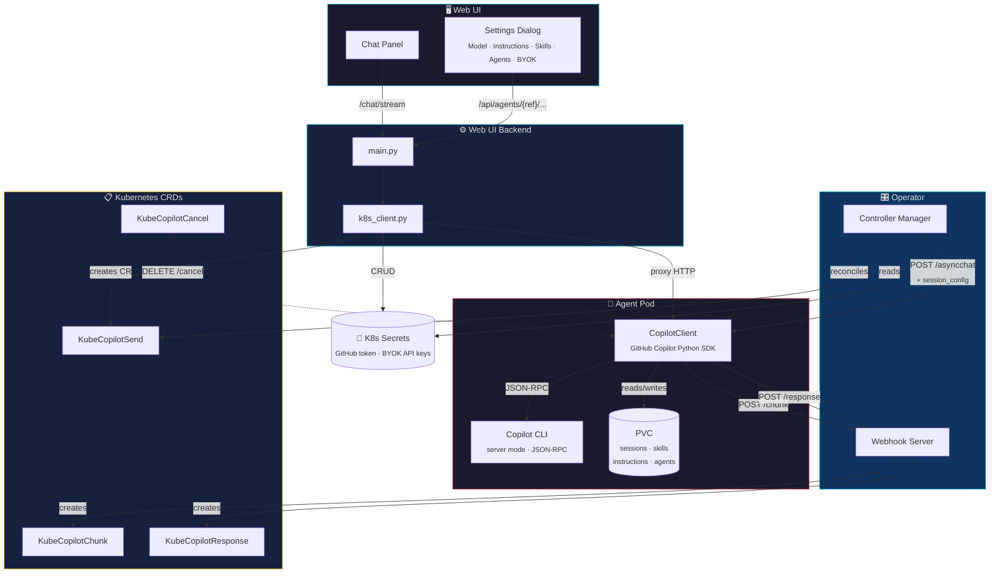
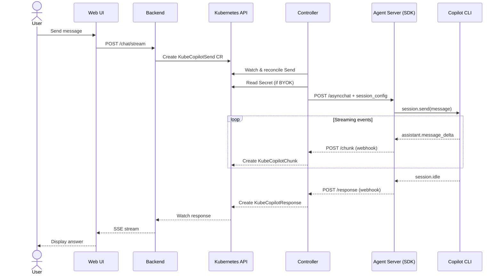
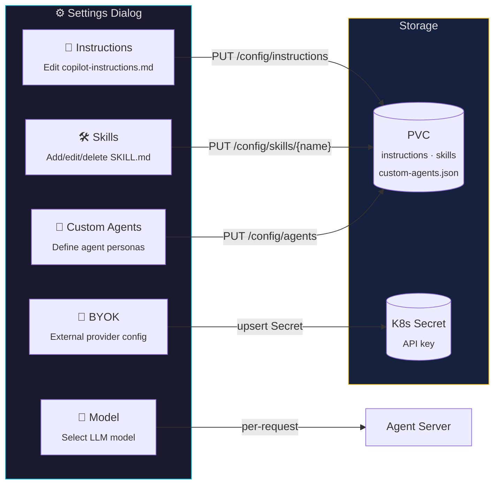
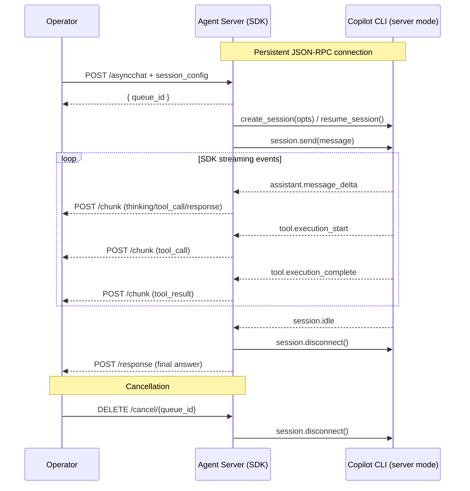
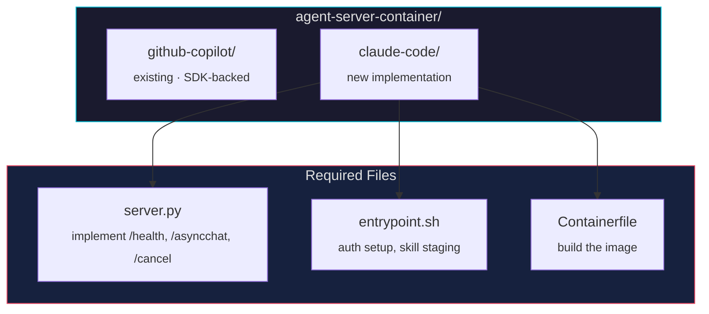
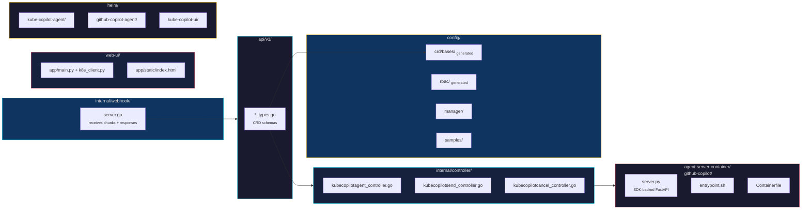

# kube-copilot-agent

> ⚠️ **Disclaimer:** This project is experimental and has not been tested in a production or live environment. It may contain bugs, security vulnerabilities, or incomplete features. Running AI agents with cluster access carries inherent risks — agents may execute unintended commands or access sensitive resources. **Use at your own risk.** Review all manifests, RBAC rules, and agent instructions carefully before deploying in any environment you care about.

A Kubernetes operator that deploys a Copilot CLI as an AI agent inside your cluster, controlled entirely through Kubernetes CRDs. Users interact with the agent by creating Kubernetes resources — no direct pod access required.

## Overview

`kube-copilot-agent` wraps a Copilot CLI, such as [GitHub Copilot CLI](https://docs.github.com/en/copilot/using-github-copilot/using-github-copilot-in-the-command-line), in a container and exposes it as a Kubernetes-native AI agent. It supports:

- **Multi-turn conversations** with session continuity
- **Real-time streaming** of agent activity via `KubeCopilotChunk` CRDs
- **Custom skills** loaded from a ConfigMap or managed at runtime via the UI
- **Custom instructions** via an `AGENT.md` ConfigMap or editable live
- **Custom agents** — define inline agent personas with specific prompts and tool sets
- **Dynamic model selection** — switch models at runtime without redeploying
- **BYOK (Bring Your Own Key)** — use an external OpenAI-compatible or Azure OpenAI provider, with API keys stored securely in Kubernetes Secrets
- **Cancellation** of in-flight requests via SDK session disconnect
- **A web UI** with a settings panel for chatting with agents, browsing session history, and configuring agent behaviour at runtime

`kube-copilot-agent` is designed to be extensible. Check for more information at [Agent Server Container](#agent-server-container).

### Architecture



#### Request Flow



### CRDs

| CRD | Purpose |
|---|---|
| `KubeCopilotAgent` | Declares an agent instance (image, credentials, skills, instructions) |
| `KubeCopilotSend` | Send a message to an agent; triggers copilot CLI execution |
| `KubeCopilotResponse` | Final response from the agent (written by operator webhook) |
| `KubeCopilotChunk` | Real-time streaming events (thinking, tool calls, results) |
| `KubeCopilotCancel` | Cancel an in-flight request |
| `KubeCopilotMessage` | Legacy single-turn message CRD |

---

## Installation

There are three Helm charts, meant to be installed in order:

| Chart | Purpose |
|---|---|
| `helm/kube-copilot-agent` | The operator (CRDs + controller) |
| `helm/github-copilot-agent` | A GitHub Copilot agent instance |
| `helm/kube-copilot-ui` | The web UI |

### Prerequisites

- kubectl v1.20+
- Helm v3.10+
- Access to a Kubernetes or OpenShift cluster
- A GitHub account with Copilot access
- A GitHub Personal Access Token (PAT) with `copilot` scope

---

### Step 1 — Install the operator

```sh
helm upgrade --install kube-copilot-agent ./helm/kube-copilot-agent \
  --namespace kube-copilot-agent \
  --create-namespace
```

If the namespace already exists:

```sh
helm upgrade --install kube-copilot-agent ./helm/kube-copilot-agent \
  --namespace kube-copilot-agent \
  --set createNamespace=false
```

**Key operator values:**

| Value | Default | Description |
|---|---|---|
| `namespace` | `kube-copilot-agent` | Namespace to deploy into |
| `createNamespace` | `true` | Create the namespace as part of the chart |
| `image.repository` | `quay.io/gfontana/kube-copilot-agent` | Operator image |
| `image.tag` | `v1.0` | Operator image tag |
| `image.pullPolicy` | `Always` | Image pull policy |
| `agentImage.repository` | `quay.io/gfontana/kube-github-copilot-agent-server` | Default agent image |
| `agentImage.tag` | `v1.0` | Default agent image tag |
| `replicaCount` | `1` | Operator replicas |
| `installCRDs` | `true` | Install CRDs with the chart |
| `rbac.create` | `true` | Create RBAC resources |
| `leaderElect` | `true` | Enable leader election |

---

### Step 2 — Create credentials

Create a secret with your GitHub PAT:

```sh
kubectl create secret generic github-token \
  --from-literal=GITHUB_TOKEN=<your-pat> \
  -n kube-copilot-agent
```

Optionally, provide a kubeconfig so the agent can inspect your cluster:

```sh
kubectl create secret generic cluster-kubeconfig \
  --from-file=config=<path-to-kubeconfig> \
  -n kube-copilot-agent
```

---

### Step 3 — Deploy the GitHub Copilot agent

The `github-copilot-agent` chart creates the `KubeCopilotAgent` CR, a GitHub token Secret, and ConfigMaps for skills and `AGENT.md`. Default skills (monitor, deploy, troubleshoot) and a SysAdmin persona are included out of the box.

**Minimal install** (uses built-in skills and AGENT.md):

```sh
helm upgrade --install my-agent ./helm/github-copilot-agent \
  --namespace kube-copilot-agent \
  --set githubToken.value=<your-pat>
```

**With an existing token secret:**

```sh
helm upgrade --install my-agent ./helm/github-copilot-agent \
  --namespace kube-copilot-agent \
  --set githubToken.existingSecret=github-token
```

**With a kubeconfig secret** (so the agent can talk to the cluster):

```sh
helm upgrade --install my-agent ./helm/github-copilot-agent \
  --namespace kube-copilot-agent \
  --set githubToken.existingSecret=github-token \
  --set kubeconfigSecretRef=cluster-kubeconfig
```

**Custom skills and AGENT.md** via a values file:

```yaml
# my-agent-values.yaml
name: my-agent
githubToken:
  existingSecret: github-token

kubeconfigSecretRef: cluster-kubeconfig

createSkillsConfigMap: true
skillsContent:
  my-skill.md: |
    ---
    name: my-skill
    description: Does something useful
    ---
    # My Skill
    ...

createAgentConfigMap: true
agentContent:
  AGENT.md: |
    # My Agent
    You are a helpful Kubernetes assistant.
```

```sh
helm upgrade --install my-agent ./helm/github-copilot-agent \
  --namespace kube-copilot-agent \
  -f my-agent-values.yaml
```

**Key agent values:**

| Value | Default | Description |
|---|---|---|
| `name` | `github-copilot-agent` | Name of the `KubeCopilotAgent` CR |
| `namespace` | `kube-copilot-agent` | Target namespace |
| `githubToken.value` | `""` | PAT value (creates a new Secret) |
| `githubToken.existingSecret` | `""` | Reference an existing Secret |
| `githubToken.secretKey` | `GITHUB_TOKEN` | Key inside the secret |
| `image` | `""` | Override the agent container image |
| `storageSize` | `1Gi` | PVC size for session history |
| `kubeconfigSecretRef` | `""` | Existing Secret name with a kubeconfig |
| `createSkillsConfigMap` | `true` | Create a skills ConfigMap from `skillsContent` |
| `skillsConfigMap` | `""` | Reference an existing skills ConfigMap |
| `createAgentConfigMap` | `true` | Create an AGENT.md ConfigMap from `agentContent` |
| `agentConfigMap` | `""` | Reference an existing AGENT.md ConfigMap |

Wait for the agent to become ready:

```sh
kubectl get kubecopilotagent my-agent -n kube-copilot-agent -w
```

---

### Step 4 — Deploy the Web UI

```sh
helm upgrade --install kube-copilot-ui ./helm/kube-copilot-ui \
  --namespace kube-copilot-agent
```

**On OpenShift** (creates a Route with TLS):

```sh
helm upgrade --install kube-copilot-ui ./helm/kube-copilot-ui \
  --namespace kube-copilot-agent \
  --set route.enabled=true
```

Then get the URL:

```sh
kubectl get route kube-copilot-ui -n kube-copilot-agent -o jsonpath='{.spec.host}'
```

**On plain Kubernetes** (port-forward):

```sh
kubectl port-forward svc/kube-copilot-ui 8080:80 -n kube-copilot-agent
# Open: http://localhost:8080
```

**Key UI values:**

| Value | Default | Description |
|---|---|---|
| `namespace` | `kube-copilot-agent` | Namespace to deploy into |
| `image.repository` | `quay.io/gfontana/kube-copilot-agent-ui` | UI image |
| `image.tag` | `v1.0` | UI image tag |
| `operatorNamespace` | `kube-copilot-agent` | Namespace the UI watches for agents |
| `commandTimeout` | `300` | Seconds to wait for an agent response |
| `imagePullSecret` | `""` | Pull secret name (for private registries) |
| `rbac.create` | `true` | Create Role/RoleBinding |
| `route.enabled` | `false` | Create an OpenShift Route |
| `route.timeout` | `360s` | HAProxy timeout for SSE streams |

---

### Uninstall

```sh
helm uninstall kube-copilot-ui      --namespace kube-copilot-agent
helm uninstall my-agent             --namespace kube-copilot-agent
helm uninstall kube-copilot-agent   --namespace kube-copilot-agent
```

---

## Interacting with an Agent

### Via the Web UI

Open the route URL in a browser, select your agent, and start chatting. The UI supports:

- Multi-turn conversations with session history in the sidebar
- **Running Sessions** panel showing in-progress requests
- **Agent Activity** tab showing real-time chunk streaming
- **Stop** button to cancel an in-flight request

### Via kubectl (CRDs directly)

**Send a message:**

```yaml
apiVersion: kubecopilot.io/v1
kind: KubeCopilotSend
metadata:
  name: my-question
  namespace: kube-copilot-agent
spec:
  agentRef: github-copilot-agent
  message: "What is the overall health of the cluster?"
  sessionID: ""   # leave empty to start a new session
```

```sh
kubectl apply -f my-question.yaml
```

**Watch real-time activity:**

```sh
kubectl get kubecopilotchunks -n kube-copilot-agent -w
```

**Read the response:**

```sh
kubectl get kubecopilotresponses -n kube-copilot-agent -o yaml
```

**Resume a session:** set `spec.sessionID` to the session ID returned in a previous `KubeCopilotResponse`.

**Cancel a request:**

```yaml
apiVersion: kubecopilot.io/v1
kind: KubeCopilotCancel
metadata:
  name: cancel-my-question
  namespace: kube-copilot-agent
spec:
  sendRef: my-question
  agentRef: github-copilot-agent
```

---

## Custom Skills

Skills are bash snippets the agent can invoke as tools. Define them in a ConfigMap with a `skills.md` key:

```yaml
apiVersion: v1
kind: ConfigMap
metadata:
  name: copilot-skills
  namespace: kube-copilot-agent
data:
  skills.md: |
    ## Skill: List unhealthy pods
    Lists all pods that are not Running or Completed.
    ```bash
    kubectl get pods -A | grep -vE "Running|Completed"
    ```
```

See `config/samples/skills-configmap.yaml` for a full example with Kubernetes operations skills.

---

## Custom Agent Instructions (AGENT.md)

Shape agent behaviour with persistent instructions:

```yaml
apiVersion: v1
kind: ConfigMap
metadata:
  name: copilot-agent-md
  namespace: kube-copilot-agent
data:
  AGENT.md: |
    # Agent Instructions
    - Always confirm the current cluster context before acting.
    - Never modify resources in production namespaces (prefixed with `prod-`).
    - Prefer read-only operations unless explicitly asked to make changes.
```

---

## Dynamic Configuration (Runtime Settings)

The web UI includes a **Settings dialog** (⚙️ button) that lets you configure agent behaviour at runtime — no pod restart or Helm upgrade needed.



### Model Selection

Switch between available Copilot models at runtime. The UI queries `/models` (backed by `client.list_models()` from the SDK) and sends the chosen model with each request via the `session_config.model` field.

### Runtime Instructions

Edit the agent's `copilot-instructions.md` file directly from the UI. Changes are written to the PVC and take effect on the next session — no restart needed.

### Runtime Skills

Create, edit, or delete skills through the UI. Each skill is stored as a `SKILL.md` file under `$COPILOT_HOME/skills/<name>/` on the PVC.

### Custom Agents

Define inline agent personas with specific prompts and tool restrictions. Stored as `custom-agents.json` on the PVC and loaded into each SDK session.

### BYOK (Bring Your Own Key)

Configure an external OpenAI-compatible or Azure OpenAI provider:
- **Provider type** and **base URL** are stored in the `KubeCopilotSend` CR's `sessionConfig.provider` field
- **API keys** are stored securely in a Kubernetes Secret and read by the controller at reconciliation time — never persisted in CRDs

```yaml
# Example: KubeCopilotSend with session config
apiVersion: kubecopilot.io/v1
kind: KubeCopilotSend
metadata:
  name: my-question
  namespace: kube-copilot-agent
spec:
  agentRef: github-copilot-agent
  message: "What is the cluster health?"
  sessionConfig:
    model: "gpt-4o"
    provider:
      type: openai
      baseURL: "https://api.openai.com/v1"
      secretRef: my-provider-secret   # K8s Secret with 'api-key' key
```

---

## Chunk Types (Real-time Streaming)

`KubeCopilotChunk` resources are created as the agent works:

| `chunkType` | Description |
|---|---|
| `thinking` | Agent's internal reasoning |
| `tool_call` | Agent invoking a skill or tool |
| `tool_result` | Result returned from the tool |
| `response` | Final answer text |
| `info` | Processing status (e.g. "Processing: ...") |
| `error` | Error during processing or cancellation |

---

## Agent Server Container

The `agent-server-container/` directory contains the server that bridges the Kubernetes operator with an AI CLI tool running inside the agent pod. Each subdirectory implements the server for a specific AI agent binary.

```
agent-server-container/
  github-copilot/       ← GitHub Copilot CLI implementation
    server.py           ← FastAPI server (SDK-backed)
    entrypoint.sh       ← Container entrypoint (auth setup, skill staging)
    Containerfile       ← Container image definition
```

### How It Works

The GitHub Copilot implementation uses the **GitHub Copilot Python SDK** (`CopilotClient`) to communicate with the Copilot CLI running in server mode via JSON-RPC. This replaces the previous subprocess-per-request approach with a persistent connection, proper session management, and typed streaming events.



**Key SDK features used:**
- `CopilotClient(SubprocessConfig)` — singleton managing the CLI in server mode
- `PermissionHandler.approve_all` — auto-approve tool executions
- `asyncio.Semaphore(3)` — bounded concurrency for parallel sessions
- `client.list_models()` — query available models for the settings UI
- `session.on(callback)` — typed event streaming for real-time chunks

**API surface the server exposes:**

| Endpoint | Method | Description |
|---|---|---|
| `/health` | GET | Liveness probe — return `{"status":"ok"}` |
| `/asyncchat` | POST | Enqueue a message (with optional `session_config`); returns `{"queue_id": "..."}` |
| `/chat` | POST | Synchronous chat — blocks until the agent responds |
| `/cancel/{queue_id}` | DELETE | Disconnect the SDK session for a given queue item |
| `/models` | GET | List available models via `client.list_models()` |
| `/config/instructions` | GET/PUT | Read or update `copilot-instructions.md` on the PVC |
| `/config/skills` | GET | List all skills on the PVC |
| `/config/skills/{name}` | GET/PUT/DELETE | Read, create/update, or delete a skill |
| `/config/agents` | GET/PUT | Read or update `custom-agents.json` on the PVC |

**Webhook payloads the shim must POST to `$WEBHOOK_URL`:**

Chunk (streamed during execution):
```json
{
  "queue_id": "<uuid>",
  "seq": 1,
  "type": "thinking|tool_call|tool_result|response|info|error",
  "content": "...",
  "session_id": "<copilot-session-id>",
  "send_ref": "...",
  "namespace": "...",
  "agent_ref": "..."
}
```

Final response (POST to `$WEBHOOK_URL`):
```json
{
  "queue_id": "<uuid>",
  "response": "full answer text",
  "session_id": "<session-id>",
  "send_ref": "...",
  "namespace": "...",
  "agent_ref": "..."
}
```

**Environment variables injected by the operator:**

| Variable | Description |
|---|---|
| `GITHUB_TOKEN` | Auth token for the AI CLI |
| `WEBHOOK_URL` | URL of the operator's internal webhook (`http://<svc>/response`) |
| `COPILOT_HOME` | Persistent storage root (backed by a PV) |
| `KUBECONFIG` | Path to kubeconfig if a `kubeconfigSecretRef` is set |

**Skills and AGENT.md** are mounted into the container as ConfigMaps:
- Skills ConfigMap → `/copilot-skills-staging/` → `entrypoint.sh` stages them into `$COPILOT_HOME/skills/<name>/SKILL.md`
- AGENT.md ConfigMap → `$COPILOT_HOME/AGENT.md`

---

### Creating a New Agent Image (e.g., Claude Code)

To support a different AI CLI (such as [Claude Code](https://docs.anthropic.com/en/docs/claude-code)), create a new subdirectory under `agent-server-container/`:



#### 1. Write `entrypoint.sh`

Set up auth and launch `server.py`, example:

```bash
#!/bin/bash
set -e

export ANTHROPIC_API_KEY="${ANTHROPIC_API_KEY}"
export AGENT_HOME="${AGENT_HOME:-/agent}"

mkdir -p "${AGENT_HOME}/sessions" "${AGENT_HOME}/.cache"

# Stage skills (same pattern as github-copilot)
if [ -d /copilot-skills-staging ]; then
  for f in /copilot-skills-staging/*.md; do
    [ -f "$f" ] || continue
    skill_name="$(basename "$f" .md)"
    mkdir -p "${AGENT_HOME}/skills/${skill_name}"
    cp "$f" "${AGENT_HOME}/skills/${skill_name}/SKILL.md"
  done
fi

exec /opt/venv/bin/python /server.py
```

#### 2. Write `server.py`

Implement the three required endpoints. Example:

```python
import asyncio, httpx, json, os, subprocess, uuid
from fastapi import FastAPI
from pydantic import BaseModel

app = FastAPI()
WEBHOOK_URL = os.environ.get("WEBHOOK_URL", "")
_active_procs = {}

class AsyncChatRequest(BaseModel):
    message: str
    session_id: str | None = None
    send_ref: str | None = None
    namespace: str | None = None
    agent_ref: str | None = None

@app.get("/health")
async def health():
    return {"status": "ok"}

@app.post("/asyncchat")
async def asyncchat(req: AsyncChatRequest):
    queue_id = str(uuid.uuid4())
    asyncio.create_task(process(queue_id, req))
    return {"queue_id": queue_id, "status": "queued"}

@app.delete("/cancel/{queue_id}")
async def cancel(queue_id: str):
    proc = _active_procs.get(queue_id)
    if proc:
        proc.terminate()
        _active_procs.pop(queue_id, None)
        return {"status": "cancelled", "queue_id": queue_id}
    return {"status": "not_found", "queue_id": queue_id}

async def process(queue_id: str, req: AsyncChatRequest):
    chunk_url = WEBHOOK_URL.replace("/response", "/chunk")
    # Launch Claude Code CLI — adapt flags to the actual binary
    cmd = ["claude", "--no-interactive", "--output-format", "stream-json",
           req.message]
(.. ommitted ..)
```

#### 3. Write `Containerfile`

```dockerfile
FROM python:3.12-slim

RUN pip install --no-cache-dir fastapi uvicorn httpx && \
    # Install the Claude Code CLI (adjust to actual install method)
    pip install claude-code

RUN useradd -m -s /bin/bash agent
WORKDIR /home/agent

COPY entrypoint.sh /entrypoint.sh
COPY server.py /server.py
RUN chmod +x /entrypoint.sh

USER agent
EXPOSE 8080
ENTRYPOINT ["/entrypoint.sh"]
```

#### 4. Add a Makefile target

```makefile
CLAUDE_IMG ?= quay.io/yourorg/kube-claude-code-agent-server:v1.0

.PHONY: container-build-claude container-push-claude
container-build-claude:
	$(CONTAINER_TOOL) build -t $(CLAUDE_IMG) ./agent-server-container/claude-code/

container-push-claude:
	$(CONTAINER_TOOL) push $(CLAUDE_IMG)
```

#### 5. Create a `KubeCopilotAgent` CR pointing to the new image

```yaml
apiVersion: kubecopilot.io/v1
kind: KubeCopilotAgent
metadata:
  name: claude-code-agent
  namespace: kube-copilot-agent
spec:
  image: quay.io/yourorg/kube-claude-code-agent-server:v1.0
  githubTokenSecretRef:   # reuse field for ANTHROPIC_API_KEY via a secret
    name: anthropic-token
  skillsConfigMap: claude-skills
  agentConfigMap: claude-agent-md
  storageSize: "1Gi"
```

The operator treats every `KubeCopilotAgent` the same way regardless of which CLI runs inside — as long as the shim implements the three-endpoint contract above, the full UI, streaming, session history, and cancellation features work automatically.

---

## Development

### Run locally

```sh
make install   # install CRDs into current cluster
make run       # run operator locally against current kubeconfig context
```

### Regenerate CRDs and RBAC after changing API types

```sh
make manifests
make generate
```

### Build and test

```sh
make build
make test
```

---

## Project Structure



| Directory | Purpose |
|---|---|
| `api/v1/` | CRD type definitions (`*_types.go`) |
| `internal/controller/` | Reconciliation logic (agent, send, cancel controllers) |
| `internal/webhook/` | HTTP server receiving chunks + responses from agent pod |
| `agent-server-container/github-copilot/` | SDK-backed FastAPI server wrapping the Copilot CLI |
| `web-ui/` | FastAPI backend + single-page chat UI with settings panel |
| `config/` | Generated CRDs, RBAC, manager manifests, samples |
| `helm/` | Helm charts for operator, agent instance, and web UI |

---

## Uninstall

**Via Helm** (recommended):

```sh
helm uninstall kube-copilot-ui      --namespace kube-copilot-agent
helm uninstall my-agent             --namespace kube-copilot-agent
helm uninstall kube-copilot-agent   --namespace kube-copilot-agent
kubectl delete namespace kube-copilot-agent
```

**Via kustomize** (development/CI):

```sh
kubectl delete -k config/samples/
make undeploy
make uninstall
kubectl delete namespace kube-copilot-agent
```

---

## License

Copyright 2026.

Licensed under the Apache License, Version 2.0 (the "License");
you may not use this file except in compliance with the License.
You may obtain a copy of the License at

    http://www.apache.org/licenses/LICENSE-2.0

Unless required by applicable law or agreed to in writing, software
distributed under the License is distributed on an "AS IS" BASIS,
WITHOUT WARRANTIES OR CONDITIONS OF ANY KIND, either express or implied.
See the License for the specific language governing permissions and
limitations under the License.
