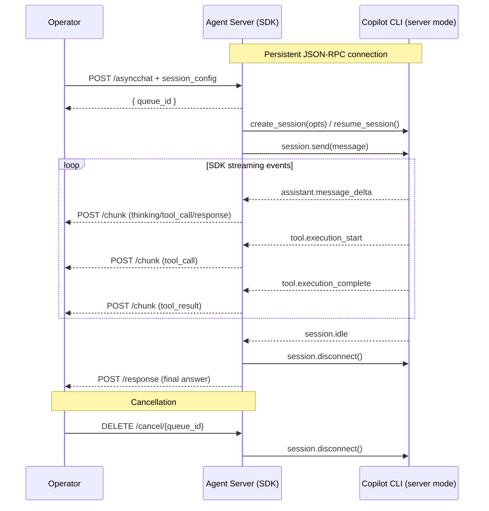
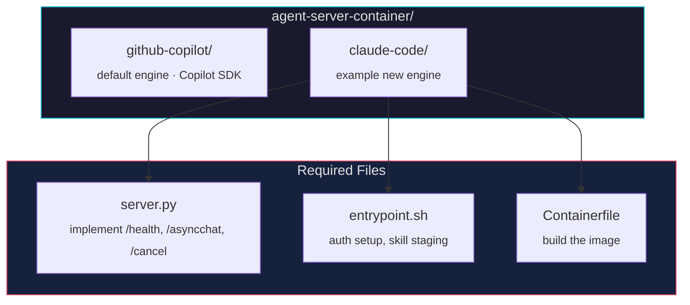

← [Back to README](../README.md)

# Agent Server Container

The `agent-server-container/` directory contains the pluggable server that bridges the Kubernetes operator with an AI backend running inside the agent pod. Each subdirectory implements the server for a **specific AI engine**. The operator doesn't care which engine is inside — as long as the container implements the [API contract](#api-contract) below, everything works.

```
agent-server-container/
  github-copilot/       ← GitHub Copilot SDK engine (default, shipped)
    server.py           ← FastAPI server (SDK-backed)
    entrypoint.sh       ← Container entrypoint (auth setup, skill staging)
    Containerfile       ← Container image definition
  claude-code/          ← (example) Claude Code engine — add your own!
```

## API Contract

Every agent server image **must** expose at minimum these HTTP endpoints:

| Endpoint | Method | Description |
|---|---|---|
| `/health` | GET | Liveness probe — return `{"status":"ok"}` |
| `/asyncchat` | POST | Enqueue a message (with optional `session_config`); returns `{"queue_id": "..."}` |
| `/cancel/{queue_id}` | DELETE | Cancel/disconnect the in-flight request for a given queue item |

The server **must** POST streaming chunks and final responses back to `$WEBHOOK_URL` (injected by the operator). Optional endpoints for richer functionality:

| Endpoint | Method | Description |
|---|---|---|
| `/chat` | POST | Synchronous chat — blocks until the agent responds |
| `/models` | GET | List available models (enables model picker in the UI) |
| `/config/instructions` | GET/PUT | Manage instructions file on the PVC |
| `/config/skills` | GET | List all skills on the PVC |
| `/config/skills/{name}` | GET/PUT/DELETE | Manage individual skills |
| `/config/agents` | GET/PUT | Manage custom agent definitions on the PVC |
| `/tasks/monitor` | POST | Register a background monitoring task (see [Background Task API](#background-task-api)) |
| `/tasks` | GET | List all background tasks |
| `/tasks/{id}` | GET | Get details of a specific background task |
| `/tasks/{id}` | DELETE | Cancel and remove a background task |

## GitHub Copilot SDK (Default Engine)

The GitHub Copilot implementation uses the **GitHub Copilot Python SDK** (`CopilotClient`) to communicate with the Copilot CLI running in server mode via JSON-RPC. This replaces the previous subprocess-per-request approach with a persistent connection, proper session management, and typed streaming events.



**Key SDK features used:**

- `CopilotClient(SubprocessConfig)` — singleton managing the CLI in server mode
- `PermissionHandler.approve_all` — auto-approve tool executions
- `asyncio.Semaphore(3)` — bounded concurrency for parallel sessions
- `client.list_models()` — query available models for the settings UI
- `session.on(callback)` — typed event streaming for real-time chunks

## Webhook Payloads

Every agent server must POST these payloads to `$WEBHOOK_URL` (injected by the operator).

**Chunk** (streamed during execution):

```json
{
  "queue_id": "<uuid>",
  "seq": 1,
  "type": "thinking|tool_call|tool_result|response|info|error",
  "content": "...",
  "session_id": "<copilot-session-id>",
  "send_ref": "...",
  "namespace": "...",
  "agent_ref": "..."
}
```

**Final response** (POST to `$WEBHOOK_URL`):

```json
{
  "queue_id": "<uuid>",
  "response": "full answer text",
  "session_id": "<session-id>",
  "send_ref": "...",
  "namespace": "...",
  "agent_ref": "..."
}
```

**Notification** (POST to `$WEBHOOK_URL` with `/response` replaced by `/notification`):

```json
{
  "session_id": "<session-id>",
  "agent_ref": "<agent-name>",
  "namespace": "<namespace>",
  "message": "Node worker-3 is now Ready!",
  "notification_type": "success",
  "title": "Background task completed",
  "task_ref": "<task-id>"
}
```

The operator webhook validates this payload, creates a `KubeCopilotNotification` CR, and the Web UI delivers it to the user via SSE. `notification_type` must be one of `info`, `success`, `warning`, or `error` (defaults to `info`). `title` and `task_ref` are optional.

## Background Task API

The GitHub Copilot agent server implements a background task framework for long-running operations. Tasks periodically check a Kubernetes resource condition or pod phase, and fire a notification to the user session when the condition is met (or when the task times out).

Tasks are persisted to `$COPILOT_HOME/tasks.json` and automatically re-launched on pod restart.

### POST /tasks/monitor

Register a new background monitoring task.

**Request body:**

| Field | Type | Required | Default | Description |
|---|---|---|---|---|
| `session_id` | `string` | ✅ | — | Session to notify when complete |
| `agent_ref` | `string` | ✅ | — | Name of the `KubeCopilotAgent` |
| `namespace` | `string` | — | `""` | Kubernetes namespace of the target resource |
| `task_type` | `string` | — | `monitor_resource` | Monitor type: `monitor_resource` or `monitor_pod_phase` |
| `config` | `object` | — | `{}` | Monitor-specific config (see below) |
| `check_interval` | `int` | — | `30` | Seconds between condition checks (minimum: 5) |
| `timeout` | `int` | — | `3600` | Maximum seconds to wait before timing out (maximum: 86400) |
| `notification_message` | `string` | — | `"Background task completed"` | Message sent in the notification |
| `notification_type` | `string` | — | `success` | Notification severity: `info`, `success`, `warning`, `error` |
| `title` | `string` | — | `"Task Completed"` | Toast popup title |

**`monitor_resource` config fields:**

| Field | Default | Description |
|---|---|---|
| `resource_type` | `nodes` | Kubernetes resource type (e.g. `pods`, `deployments`) |
| `resource_name` | `""` | Name of the resource |
| `condition_type` | `Ready` | Status condition type to check |
| `condition_status` | `True` | Expected condition status |
| `api_version` | `v1` | API version (e.g. `v1`, `apps/v1`) |
| `resource_namespace` | `""` | Namespace of the resource (empty for cluster-scoped) |

**`monitor_pod_phase` config fields:**

| Field | Default | Description |
|---|---|---|
| `pod_name` | `""` | Name of the pod |
| `pod_namespace` | `default` | Namespace of the pod |
| `target_phase` | `Running` | Target pod phase (e.g. `Running`, `Succeeded`) |

**Response:**

```json
{ "task_id": "task-abc123def456", "status": "created" }
```

**Example — monitor a node until Ready:**

```bash
curl -X POST http://<agent-svc>:8080/tasks/monitor \
  -H 'Content-Type: application/json' \
  -d '{
    "session_id": "abc",
    "agent_ref": "my-agent",
    "namespace": "default",
    "task_type": "monitor_resource",
    "config": {
      "resource_type": "nodes",
      "resource_name": "worker-3",
      "condition_type": "Ready",
      "condition_status": "True"
    },
    "check_interval": 30,
    "timeout": 3600,
    "notification_message": "Node worker-3 is now Ready!"
  }'
```

### GET /tasks

List all background tasks. Returns `{ "tasks": [...] }` where each item includes `task_id`, `task_type`, `status`, `session_id`, `title`, and `config`.

### GET /tasks/{task_id}

Get full details of a specific task, including `check_interval`, `timeout`, and `notification_message`.

### DELETE /tasks/{task_id}

Cancel and remove a task. Returns `{ "status": "deleted", "task_id": "..." }`.

## Environment Variables

Variables injected by the operator into the agent container:

| Variable | Description |
|---|---|
| `GITHUB_TOKEN` | Auth token from the `githubTokenSecretRef` (can be repurposed for any API key) |
| `WEBHOOK_URL` | URL of the operator's internal webhook (`http://<svc>/response`) |
| `COPILOT_HOME` | Persistent storage root (backed by a PV) |
| `KUBECONFIG` | Path to kubeconfig if a `kubeconfigSecretRef` is set |

**Skills and AGENT.md** are mounted into the container as ConfigMaps:

- Skills ConfigMap → `/copilot-skills-staging/` → `entrypoint.sh` stages them into `$COPILOT_HOME/skills/<name>/SKILL.md`
- AGENT.md ConfigMap → `$COPILOT_HOME/AGENT.md`

## Creating a New Agent Image (e.g., Claude Code)

To add a new AI engine (such as [Claude Code](https://docs.anthropic.com/en/docs/claude-code)), create a new subdirectory under `agent-server-container/` and implement the [API contract](#api-contract):



### 1. Write entrypoint.sh

Set up auth and launch `server.py`:

```bash
#!/bin/bash
set -e

export ANTHROPIC_API_KEY="${ANTHROPIC_API_KEY}"
export AGENT_HOME="${AGENT_HOME:-/agent}"

mkdir -p "${AGENT_HOME}/sessions" "${AGENT_HOME}/.cache"

# Stage skills (same pattern as github-copilot)
if [ -d /copilot-skills-staging ]; then
  for f in /copilot-skills-staging/*.md; do
    [ -f "$f" ] || continue
    skill_name="$(basename "$f" .md)"
    mkdir -p "${AGENT_HOME}/skills/${skill_name}"
    cp "$f" "${AGENT_HOME}/skills/${skill_name}/SKILL.md"
  done
fi

exec /opt/venv/bin/python /server.py
```

### 2. Write server.py

Implement the three required endpoints:

```python
import asyncio, httpx, json, os, subprocess, uuid
from fastapi import FastAPI
from pydantic import BaseModel

app = FastAPI()
WEBHOOK_URL = os.environ.get("WEBHOOK_URL", "")
_active_procs = {}

class AsyncChatRequest(BaseModel):
    message: str
    session_id: str | None = None
    send_ref: str | None = None
    namespace: str | None = None
    agent_ref: str | None = None

@app.get("/health")
async def health():
    return {"status": "ok"}

@app.post("/asyncchat")
async def asyncchat(req: AsyncChatRequest):
    queue_id = str(uuid.uuid4())
    asyncio.create_task(process(queue_id, req))
    return {"queue_id": queue_id, "status": "queued"}

@app.delete("/cancel/{queue_id}")
async def cancel(queue_id: str):
    proc = _active_procs.get(queue_id)
    if proc:
        proc.terminate()
        _active_procs.pop(queue_id, None)
        return {"status": "cancelled", "queue_id": queue_id}
    return {"status": "not_found", "queue_id": queue_id}

async def process(queue_id: str, req: AsyncChatRequest):
    chunk_url = WEBHOOK_URL.replace("/response", "/chunk")
    # Launch Claude Code CLI — adapt flags to the actual binary
    cmd = ["claude", "--no-interactive", "--output-format", "stream-json",
           req.message]
(.. omitted ..)
```

### 3. Write Containerfile

```dockerfile
FROM python:3.12-slim

RUN pip install --no-cache-dir fastapi uvicorn httpx && \
    # Install the Claude Code CLI (adjust to actual install method)
    pip install claude-code

RUN useradd -m -s /bin/bash agent
WORKDIR /home/agent

COPY entrypoint.sh /entrypoint.sh
COPY server.py /server.py
RUN chmod +x /entrypoint.sh

USER agent
EXPOSE 8080
ENTRYPOINT ["/entrypoint.sh"]
```

### 4. Add a Makefile target

```makefile
CLAUDE_IMG ?= quay.io/yourorg/kube-claude-code-agent-server:v1.0

.PHONY: container-build-claude container-push-claude
container-build-claude:
$(CONTAINER_TOOL) build -t $(CLAUDE_IMG) ./agent-server-container/claude-code/

container-push-claude:
$(CONTAINER_TOOL) push $(CLAUDE_IMG)
```

### 5. Create a KubeCopilotAgent CR pointing to the new image

```yaml
apiVersion: kubecopilot.io/v1
kind: KubeCopilotAgent
metadata:
  name: claude-code-agent
  namespace: kube-copilot-agent
spec:
  image: quay.io/yourorg/kube-claude-code-agent-server:v1.0
  githubTokenSecretRef:   # reuse field for ANTHROPIC_API_KEY via a secret
    name: anthropic-token
  skillsConfigMap: claude-skills
  agentConfigMap: claude-agent-md
  storageSize: "1Gi"
```

The operator treats every `KubeCopilotAgent` the same way regardless of which AI engine runs inside — as long as the container implements the [API contract](#api-contract), the full UI, streaming, session history, and cancellation features work automatically.
