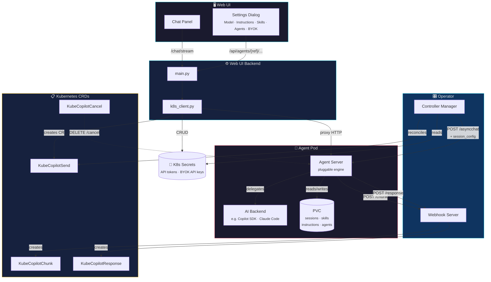
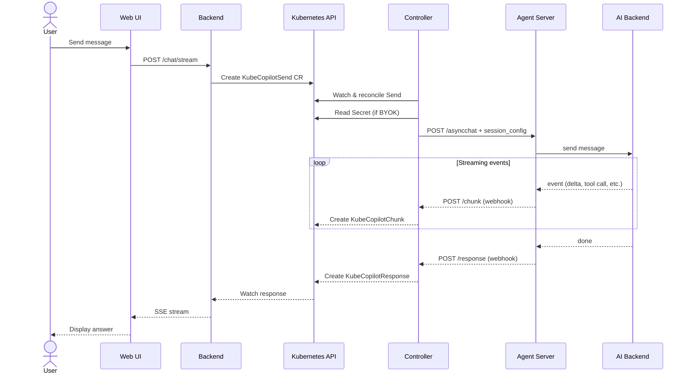

← [Back to README](../README.md)

# Architecture

kube-copilot-agent is built around a Kubernetes operator that manages AI agent pods through CRDs. The operator is engine-agnostic — it communicates with any agent server container that implements the required API contract.

## Request Flow

## CRDs

| CRD | Purpose |
|---|---|
| `KubeCopilotAgent` | Declares an agent instance (image, credentials, skills, instructions) |
| `KubeCopilotSend` | Send a message to an agent; dispatched to the agent server |
| `KubeCopilotResponse` | Final response from the agent (written by operator webhook) |
| `KubeCopilotChunk` | Real-time streaming events (thinking, tool calls, results) |
| `KubeCopilotCancel` | Cancel an in-flight request |
| `KubeCopilotMessage` | Legacy single-turn message CRD |
