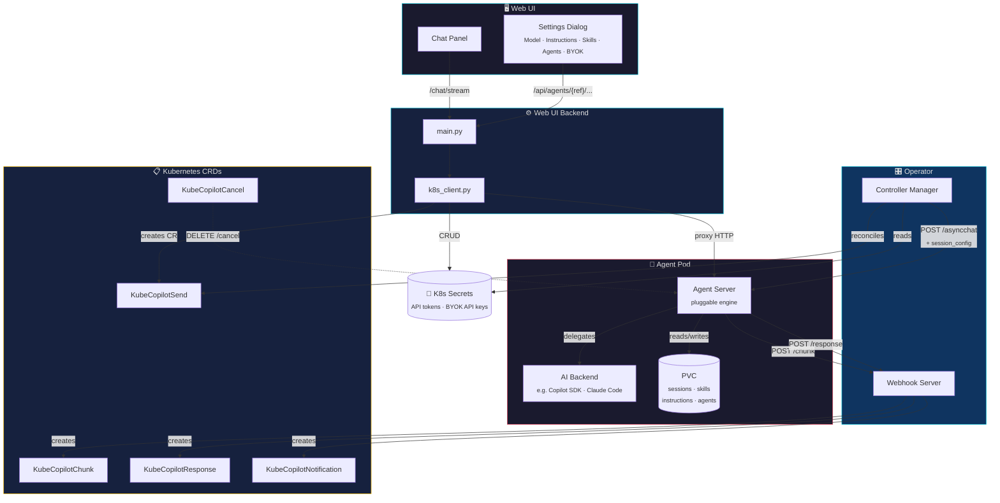
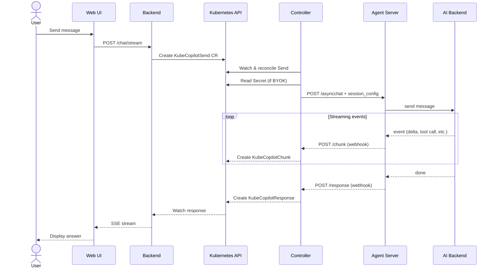

← [Back to README](../README.md)

# Architecture

kube-copilot-agent is built around a Kubernetes operator that manages AI agent pods through CRDs. The operator is engine-agnostic — it communicates with any agent server container that implements the required API contract.



## Request Flow



## CRDs

| CRD | Purpose |
|---|---|
| `KubeCopilotAgent` | Declares an agent instance (image, credentials, skills, instructions) |
| `KubeCopilotSession` | Creates an isolated tenant session: dedicated namespace, NetworkPolicy, and RBAC for namespace-per-tenant isolation |
| `KubeCopilotSend` | Send a message to an agent; dispatched to the agent server |
| `KubeCopilotResponse` | Final response from the agent (written by operator webhook) |
| `KubeCopilotChunk` | Real-time streaming events (thinking, tool calls, results) |
| `KubeCopilotCancel` | Cancel an in-flight request |
| `KubeCopilotNotification` | One-way notification pushed by the agent to a user session (e.g. background task completion) |
| `KubeCopilotMessage` | Legacy single-turn message CRD |

### KubeCopilotNotification

`KubeCopilotNotification` CRs are created by the operator webhook when the agent server POSTs a notification (e.g. when a background monitoring task completes). The Web UI polls for new notifications via SSE and displays them as inline bubbles and toast popups.

**Spec fields:**

| Field | Type | Required | Description |
|---|---|---|---|
| `agentRef` | `string` | ✅ | Name of the `KubeCopilotAgent` that produced this notification |
| `sessionID` | `string` | ✅ | Conversation session this notification belongs to |
| `message` | `string` | ✅ | Notification body (supports markdown) |
| `notificationType` | `string` | — | Severity: `info` \| `success` \| `warning` \| `error` (default: `info`) |
| `title` | `string` | — | Short summary shown in toast popups |
| `taskRef` | `string` | — | ID of the background task that triggered this notification |

**Example:**

```yaml
apiVersion: kubecopilot.io/v1
kind: KubeCopilotNotification
metadata:
  name: notif-abc123
  namespace: kube-copilot-agent
  labels:
    kubecopilot.io/agent-ref: my-agent
    kubecopilot.io/session-id: session-xyz
spec:
  agentRef: my-agent
  sessionID: session-xyz
  message: "Node **worker-3** is now Ready!"
  notificationType: success
  title: "Background task completed"
  taskRef: task-abc123def456
```
