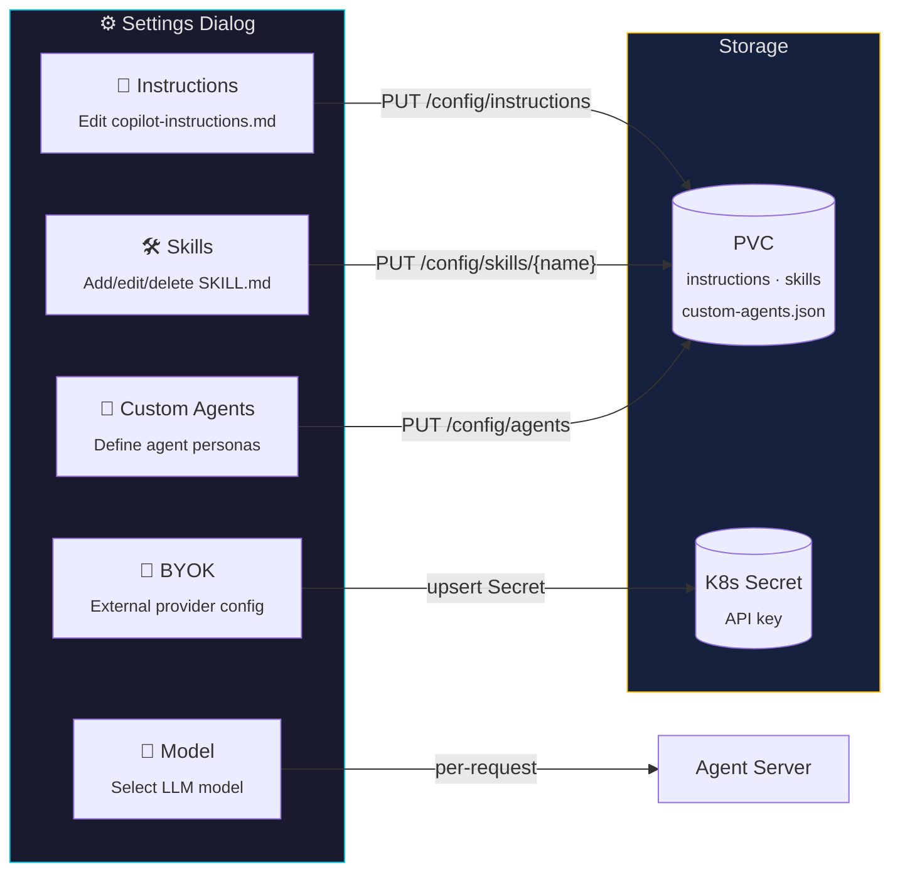

← [Back to README](../README.md)

# Configuration

## Custom Skills

Skills are bash snippets the agent can invoke as tools. Define them in a ConfigMap with a `skills.md` key:

```yaml
apiVersion: v1
kind: ConfigMap
metadata:
  name: copilot-skills
  namespace: kube-copilot-agent
data:
  skills.md: |
    ## Skill: List unhealthy pods
    Lists all pods that are not Running or Completed.
    ```bash
    kubectl get pods -A | grep -vE "Running|Completed"
    ```
```

> [!NOTE]
> See `config/samples/skills-configmap.yaml` for a full example with Kubernetes operations skills.

## Custom Instructions (AGENT.md)

Shape agent behaviour with persistent instructions:

```yaml
apiVersion: v1
kind: ConfigMap
metadata:
  name: copilot-agent-md
  namespace: kube-copilot-agent
data:
  AGENT.md: |
    # Agent Instructions
    - Always confirm the current cluster context before acting.
    - Never modify resources in production namespaces (prefixed with `prod-`).
    - Prefer read-only operations unless explicitly asked to make changes.
```

## Dynamic Configuration (Runtime Settings)

The web UI includes a **Settings dialog** that lets you configure agent behaviour at runtime — no pod restart or Helm upgrade needed.



### Model Selection

Switch between available Copilot models at runtime. The UI queries `/models` (backed by `client.list_models()` from the SDK) and sends the chosen model with each request via the `session_config.model` field.

### Runtime Instructions

Edit the agent's `copilot-instructions.md` file directly from the UI. Changes are written to the PVC and take effect on the next session — no restart needed.

### Runtime Skills

Create, edit, or delete skills through the UI. Each skill is stored as a `SKILL.md` file under `$COPILOT_HOME/skills/<name>/` on the PVC.

### Custom Agents

Define inline agent personas with specific prompts and tool restrictions. Stored as `custom-agents.json` on the PVC and loaded into each SDK session.

### BYOK (Bring Your Own Key)

Configure an external OpenAI-compatible or Azure OpenAI provider:

- **Provider type** and **base URL** are stored in the `KubeCopilotSend` CR's `sessionConfig.provider` field
- **API keys** are stored securely in a Kubernetes Secret and read by the controller at reconciliation time — never persisted in CRDs

```yaml
# Example: KubeCopilotSend with session config
apiVersion: kubecopilot.io/v1
kind: KubeCopilotSend
metadata:
  name: my-question
  namespace: kube-copilot-agent
spec:
  agentRef: github-copilot-agent
  message: "What is the cluster health?"
  sessionConfig:
    model: "gpt-4o"
    provider:
      type: openai
      baseURL: "https://api.openai.com/v1"
      secretRef: my-provider-secret   # K8s Secret with 'api-key' key
```

## ServiceAccount-Based Permissions

By default, agents interact with the cluster through a manually-created `kubeconfigSecretRef`. The **RBAC configuration** option lets the operator manage all of this automatically — creating a dedicated ServiceAccount, RBAC Role/ClusterRole, bindings, and a kubeconfig Secret so each agent runs with **least-privilege** access.

### How it works

When you set `spec.rbac` in a `KubeCopilotAgent`, the operator:

1. **Creates a ServiceAccount** (name defaults to `<agent-name>-sa` or uses `rbac.serviceAccountName`)
2. **Creates a Role** (namespace-scoped) with the rules you specify in `rbac.rules`
3. **Creates a RoleBinding** to bind the ServiceAccount to that Role
4. **Creates a ClusterRole** (cluster-scoped) with the rules in `rbac.clusterRules` (optional)
5. **Creates a ClusterRoleBinding** to bind the ServiceAccount to that ClusterRole
6. **Generates a kubeconfig Secret** that uses the ServiceAccount token for authentication
7. **Mounts the kubeconfig** into the agent pod at `/copilot/.kube/config`

Namespace-scoped resources (ServiceAccount, Role, RoleBinding, kubeconfig Secret) are owned by the `KubeCopilotAgent` and garbage-collected on deletion. Cluster-scoped resources (ClusterRole, ClusterRoleBinding) are cleaned up via a finalizer (`kubecopilot.io/rbac-cleanup`) since namespaced owners cannot GC cluster-scoped resources directly.

> [!NOTE]
> `spec.rbac` is mutually exclusive with `spec.kubeconfigSecretRef`. Use one or the other.

### AgentRBAC Fields

| Field | Type | Required | Description |
|---|---|---|---|
| `serviceAccountName` | `string` | No | Name of the ServiceAccount to create; defaults to `<agent-name>-sa` |
| `rules` | `[]rbacv1.PolicyRule` | No | Namespace-scoped permissions (Role + RoleBinding) |
| `clusterRules` | `[]rbacv1.PolicyRule` | No | Cluster-scoped permissions (ClusterRole + ClusterRoleBinding) |

### CR Example

```yaml
apiVersion: kubecopilot.io/v1
kind: KubeCopilotAgent
metadata:
  name: my-agent
  namespace: kube-copilot-agent
spec:
  githubTokenSecretRef:
    name: github-token
  rbac:
    serviceAccountName: my-agent-sa   # optional, defaults to "<name>-sa"
    rules:                             # namespace-scoped
      - apiGroups: [""]
        resources: ["pods", "services", "configmaps", "events"]
        verbs: ["get", "list", "watch"]
      - apiGroups: ["apps"]
        resources: ["deployments", "replicasets"]
        verbs: ["get", "list", "watch"]
    clusterRules:                      # cluster-scoped (optional)
      - apiGroups: [""]
        resources: ["namespaces", "nodes"]
        verbs: ["get", "list"]
```

### Helm Example

```yaml
# my-agent-rbac-values.yaml
githubToken:
  existingSecret: github-token

rbac:
  serviceAccountName: my-agent-sa
  rules:
    - apiGroups: [""]
      resources: ["pods", "services", "configmaps"]
      verbs: ["get", "list", "watch"]
    - apiGroups: ["apps"]
      resources: ["deployments"]
      verbs: ["get", "list", "watch"]
  clusterRules:
    - apiGroups: [""]
      resources: ["namespaces", "nodes"]
      verbs: ["get", "list"]
```

```sh
helm upgrade --install my-agent ./helm/github-copilot-agent \
  --namespace kube-copilot-agent \
  -f my-agent-rbac-values.yaml
```

### Verifying Permissions

```sh
# Check what the ServiceAccount can do in the agent namespace
kubectl auth can-i --list \
  --as=system:serviceaccount:kube-copilot-agent:my-agent-sa \
  -n kube-copilot-agent

# Check cluster-scoped permissions
kubectl auth can-i list namespaces \
  --as=system:serviceaccount:kube-copilot-agent:my-agent-sa

# Inspect the generated RBAC resources
kubectl get sa,role,rolebinding -n kube-copilot-agent | grep my-agent
kubectl get clusterrole,clusterrolebinding | grep my-agent
```

## Chunk Types (Real-time Streaming)

`KubeCopilotChunk` resources are created as the agent works:

| `chunkType` | Description |
|---|---|
| `thinking` | Agent's internal reasoning |
| `tool_call` | Agent invoking a skill or tool |
| `tool_result` | Result returned from the tool |
| `response` | Final answer text |
| `info` | Processing status (e.g. "Processing: ...") |
| `error` | Error during processing or cancellation |
