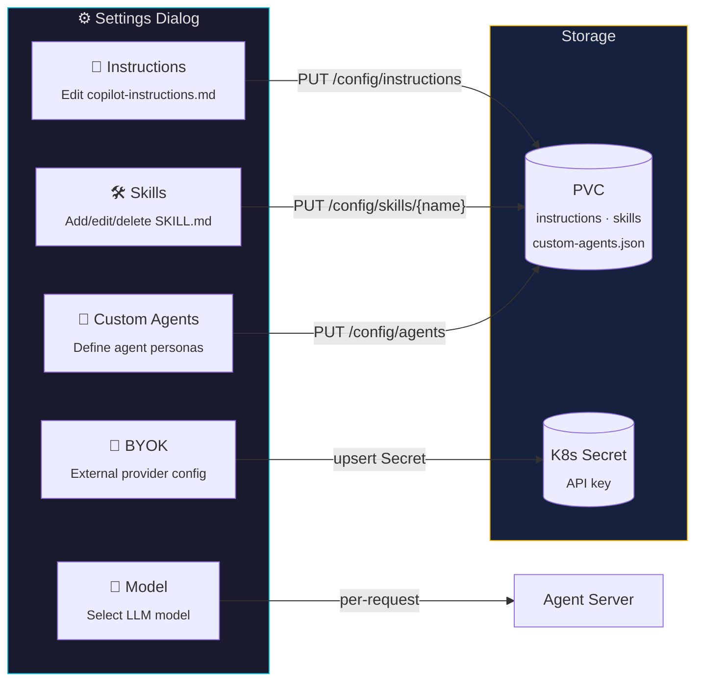

← [Back to README](../README.md)

# Configuration

## Custom Skills

Skills are bash snippets the agent can invoke as tools. Define them in a ConfigMap with a `skills.md` key:

```yaml
apiVersion: v1
kind: ConfigMap
metadata:
  name: copilot-skills
  namespace: kube-copilot-agent
data:
  skills.md: |
    ## Skill: List unhealthy pods
    Lists all pods that are not Running or Completed.
    ```bash
    kubectl get pods -A | grep -vE "Running|Completed"
    ```
```

> [!NOTE]
> See `config/samples/skills-configmap.yaml` for a full example with Kubernetes operations skills.

## Custom Instructions (AGENT.md)

Shape agent behaviour with persistent instructions:

```yaml
apiVersion: v1
kind: ConfigMap
metadata:
  name: copilot-agent-md
  namespace: kube-copilot-agent
data:
  AGENT.md: |
    # Agent Instructions
    - Always confirm the current cluster context before acting.
    - Never modify resources in production namespaces (prefixed with `prod-`).
    - Prefer read-only operations unless explicitly asked to make changes.
```

## Dynamic Configuration (Runtime Settings)

The web UI includes a **Settings dialog** that lets you configure agent behaviour at runtime — no pod restart or Helm upgrade needed.



### Model Selection

Switch between available Copilot models at runtime. The UI queries `/models` (backed by `client.list_models()` from the SDK) and sends the chosen model with each request via the `session_config.model` field.

### Runtime Instructions

Edit the agent's `copilot-instructions.md` file directly from the UI. Changes are written to the PVC and take effect on the next session — no restart needed.

### Runtime Skills

Create, edit, or delete skills through the UI. Each skill is stored as a `SKILL.md` file under `$COPILOT_HOME/skills/<name>/` on the PVC.

### Custom Agents

Define inline agent personas with specific prompts and tool restrictions. Stored as `custom-agents.json` on the PVC and loaded into each SDK session.

### BYOK (Bring Your Own Key)

Configure an external OpenAI-compatible or Azure OpenAI provider:

- **Provider type** and **base URL** are stored in the `KubeCopilotSend` CR's `sessionConfig.provider` field
- **API keys** are stored securely in a Kubernetes Secret and read by the controller at reconciliation time — never persisted in CRDs

```yaml
# Example: KubeCopilotSend with session config
apiVersion: kubecopilot.io/v1
kind: KubeCopilotSend
metadata:
  name: my-question
  namespace: kube-copilot-agent
spec:
  agentRef: github-copilot-agent
  message: "What is the cluster health?"
  sessionConfig:
    model: "gpt-4o"
    provider:
      type: openai
      baseURL: "https://api.openai.com/v1"
      secretRef: my-provider-secret   # K8s Secret with 'api-key' key
```

## Chunk Types (Real-time Streaming)

`KubeCopilotChunk` resources are created as the agent works:

| `chunkType` | Description |
|---|---|
| `thinking` | Agent's internal reasoning |
| `tool_call` | Agent invoking a skill or tool |
| `tool_result` | Result returned from the tool |
| `response` | Final answer text |
| `info` | Processing status (e.g. "Processing: ...") |
| `error` | Error during processing or cancellation |
