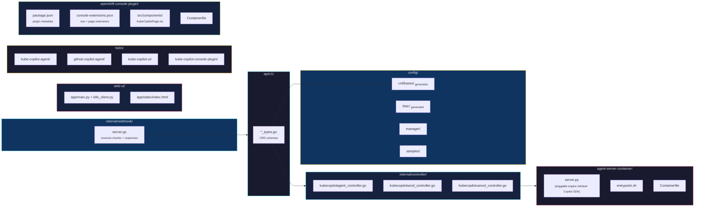

← [Back to README](../README.md)

# Development Guide

## Run locally

```sh
make install   # install CRDs into current cluster
make run       # run operator locally against current kubeconfig context
```

## Regenerate CRDs and RBAC after changing API types

```sh
make manifests
make generate
```

## Build and test

```sh
make build
make test
```

## Project Structure



| Directory | Purpose |
|---|---|
| `api/v1/` | CRD type definitions (`*_types.go`) |
| `internal/controller/` | Reconciliation logic (agent, send, cancel controllers) |
| `internal/webhook/` | HTTP server receiving chunks + responses from agent pod |
| `agent-server-container/github-copilot/` | Default engine: SDK-backed FastAPI server wrapping the Copilot CLI |
| `web-ui/` | FastAPI backend + single-page chat UI with settings panel |
| `openshift-console-plugin/` | OpenShift Console dynamic plugin (embeds Web UI in Console) |
| `config/` | Generated CRDs, RBAC, manager manifests, samples |
| `helm/` | Helm charts for operator, agent instance, web UI, and console plugin |
