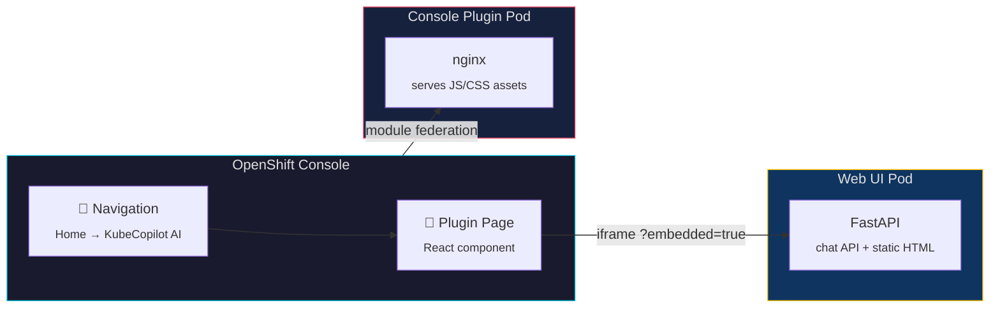

← [Back to README](../README.md)

# Installation Guide

There are three Helm charts, meant to be installed in order:

| Chart | Purpose |
|---|---|
| `helm/kube-copilot-agent` | The operator (CRDs + controller) |
| `helm/github-copilot-agent` | A GitHub Copilot agent instance |
| `helm/kube-copilot-ui` | The web UI |

## Prerequisites

- kubectl v1.20+
- Helm v3.10+
- Access to a Kubernetes or OpenShift cluster
- A GitHub account with Copilot access
- A GitHub Personal Access Token (PAT) with `copilot` scope

## Step 1 — Install the Operator

```sh
helm upgrade --install kube-copilot-agent ./helm/kube-copilot-agent \
  --namespace kube-copilot-agent \
  --create-namespace
```

If the namespace already exists:

```sh
helm upgrade --install kube-copilot-agent ./helm/kube-copilot-agent \
  --namespace kube-copilot-agent \
  --set createNamespace=false
```

**Key operator values:**

| Value | Default | Description |
|---|---|---|
| `namespace` | `kube-copilot-agent` | Namespace to deploy into |
| `createNamespace` | `true` | Create the namespace as part of the chart |
| `image.repository` | `quay.io/gfontana/kube-copilot-agent` | Operator image |
| `image.tag` | `v1.0` | Operator image tag |
| `image.pullPolicy` | `Always` | Image pull policy |
| `agentImage.repository` | `quay.io/gfontana/kube-github-copilot-agent-server` | Default agent image |
| `agentImage.tag` | `v1.0` | Default agent image tag |
| `replicaCount` | `1` | Operator replicas |
| `installCRDs` | `true` | Install CRDs with the chart |
| `rbac.create` | `true` | Create RBAC resources |
| `leaderElect` | `true` | Enable leader election |

## Step 2 — Create Credentials

Create a secret with your GitHub PAT:

```sh
kubectl create secret generic github-token \
  --from-literal=GITHUB_TOKEN=<your-pat> \
  -n kube-copilot-agent
```

Optionally, provide a kubeconfig so the agent can inspect your cluster:

```sh
kubectl create secret generic cluster-kubeconfig \
  --from-file=config=<path-to-kubeconfig> \
  -n kube-copilot-agent
```

## Step 3 — Deploy the GitHub Copilot Agent

The `github-copilot-agent` chart creates the `KubeCopilotAgent` CR, a GitHub token Secret, and ConfigMaps for skills and `AGENT.md`. Default skills (monitor, deploy, troubleshoot) and a SysAdmin persona are included out of the box.

**Minimal install** (uses built-in skills and AGENT.md):

```sh
helm upgrade --install my-agent ./helm/github-copilot-agent \
  --namespace kube-copilot-agent \
  --set githubToken.value=<your-pat>
```

**With an existing token secret:**

```sh
helm upgrade --install my-agent ./helm/github-copilot-agent \
  --namespace kube-copilot-agent \
  --set githubToken.existingSecret=github-token
```

**With a kubeconfig secret** (so the agent can talk to the cluster):

```sh
helm upgrade --install my-agent ./helm/github-copilot-agent \
  --namespace kube-copilot-agent \
  --set githubToken.existingSecret=github-token \
  --set kubeconfigSecretRef=cluster-kubeconfig
```

**Custom skills and AGENT.md** via a values file:

```yaml
# my-agent-values.yaml
name: my-agent
githubToken:
  existingSecret: github-token

kubeconfigSecretRef: cluster-kubeconfig

createSkillsConfigMap: true
skillsContent:
  my-skill.md: |
    ---
    name: my-skill
    description: Does something useful
    ---
    # My Skill
    ...

createAgentConfigMap: true
agentContent:
  AGENT.md: |
    # My Agent
    You are a helpful Kubernetes assistant.
```

```sh
helm upgrade --install my-agent ./helm/github-copilot-agent \
  --namespace kube-copilot-agent \
  -f my-agent-values.yaml
```

**Key agent values:**

| Value | Default | Description |
|---|---|---|
| `name` | `github-copilot-agent` | Name of the `KubeCopilotAgent` CR |
| `namespace` | `kube-copilot-agent` | Target namespace |
| `githubToken.value` | `""` | PAT value (creates a new Secret) |
| `githubToken.existingSecret` | `""` | Reference an existing Secret |
| `githubToken.secretKey` | `GITHUB_TOKEN` | Key inside the secret |
| `image` | `""` | Override the agent container image |
| `storageSize` | `1Gi` | PVC size for session history |
| `kubeconfigSecretRef` | `""` | Existing Secret name with a kubeconfig |
| `createSkillsConfigMap` | `true` | Create a skills ConfigMap from `skillsContent` |
| `skillsConfigMap` | `""` | Reference an existing skills ConfigMap |
| `createAgentConfigMap` | `true` | Create an AGENT.md ConfigMap from `agentContent` |
| `agentConfigMap` | `""` | Reference an existing AGENT.md ConfigMap |

Wait for the agent to become ready:

```sh
kubectl get kubecopilotagent my-agent -n kube-copilot-agent -w
```

## Step 4 — Deploy the Web UI

```sh
helm upgrade --install kube-copilot-ui ./helm/kube-copilot-ui \
  --namespace kube-copilot-agent
```

**On OpenShift** (creates a Route with TLS):

```sh
helm upgrade --install kube-copilot-ui ./helm/kube-copilot-ui \
  --namespace kube-copilot-agent \
  --set route.enabled=true
```

Then get the URL:

```sh
kubectl get route kube-copilot-ui -n kube-copilot-agent -o jsonpath='{.spec.host}'
```

**On plain Kubernetes** (port-forward):

```sh
kubectl port-forward svc/kube-copilot-ui 8080:80 -n kube-copilot-agent
# Open: http://localhost:8080
```

**Key UI values:**

| Value | Default | Description |
|---|---|---|
| `namespace` | `kube-copilot-agent` | Namespace to deploy into |
| `image.repository` | `quay.io/gfontana/kube-copilot-agent-ui` | UI image |
| `image.tag` | `v1.0` | UI image tag |
| `operatorNamespace` | `kube-copilot-agent` | Namespace the UI watches for agents |
| `commandTimeout` | `300` | Seconds to wait for an agent response |
| `imagePullSecret` | `""` | Pull secret name (for private registries) |
| `rbac.create` | `true` | Create Role/RoleBinding |
| `route.enabled` | `false` | Create an OpenShift Route |
| `route.timeout` | `360s` | HAProxy timeout for SSE streams |

## Step 5 — (Optional) Deploy the OpenShift Console Plugin

If you're running on **OpenShift**, you can embed the KubeCopilot UI directly inside the OpenShift Web Console as a [dynamic plugin](https://github.com/openshift/console/tree/main/frontend/packages/console-dynamic-plugin-sdk).



**Build the plugin image:**

```sh
cd openshift-console-plugin
podman build -t quay.io/yourorg/kube-copilot-console-plugin:latest .
podman push quay.io/yourorg/kube-copilot-console-plugin:latest
```

**Install via Helm:**

```sh
helm upgrade --install kube-copilot-console-plugin ./helm/kube-copilot-console-plugin \
  --namespace kube-copilot-agent \
  --set plugin.image=quay.io/yourorg/kube-copilot-console-plugin:latest \
  --set webUI.serviceName=kube-copilot-ui \
  --set webUI.servicePort=8000
```

After installation, refresh the OpenShift Console — a new **"KubeCopilot AI"** nav item appears under **Home** in both the Administrator and Developer perspectives.

**How it works:**

1. A `ConsolePlugin` CR registers the plugin with the OpenShift Console operator
2. A post-install Job patches the Console operator config to enable the plugin
3. The plugin page loads the existing Web UI inside an iframe with `?embedded=true`
4. In embedded mode, the Web UI hides its own header and sizes itself to fill the Console content area; the plugin uses a `ResizeObserver` on the main content element for accurate layout when the sidebar is toggled, plus a `MutationObserver` for class/style changes
5. **Responsive sidebar**: in embedded mode the sidebar width narrows to 180 px at ≤ 900 px viewport width and is hidden entirely at ≤ 600 px to maximise the chat area in small frames
6. Theme sync: the plugin forwards OpenShift Console dark/light mode changes to the iframe via `postMessage`

**Key Helm values:**

| Value | Default | Description |
|---|---|---|
| `plugin.image` | *(required)* | Console plugin container image |
| `plugin.name` | `kube-copilot-console-plugin` | Name of the `ConsolePlugin` CR |
| `plugin.replicas` | `2` | Number of plugin pod replicas |
| `plugin.port` | `9443` | HTTPS port for nginx (auto-TLS via serving cert) |
| `webUI.serviceName` | `kube-copilot-ui` | Name of the KubeCopilot Web UI service |
| `webUI.serviceNamespace` | *(release namespace)* | Namespace of the Web UI service |
| `webUI.servicePort` | `8000` | Port of the Web UI service |
